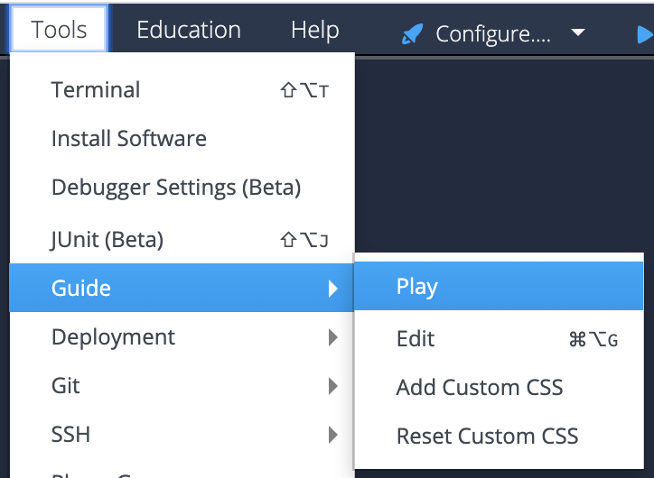

# Hello Codio in R/RStudio
This project shows you a sample lesson page in Codio and then explains how it was built. It then demonstrates Codio's auto-graded assessment capabilities.

Feel free to edit and try things out -- if you need a new copy of this project, go to [Starter Pack](https://codio.com/home/starter-packs/ff89204f-fb43-4526-9f55-4ec3e1b5d0ca) click **Use Pack** and click **Create** to add it to your projects.

## Start the Guide to see the project
If you are seeing this, you are currently in edit mode. To start Guides from this page, go to the tool bar at the top:

To view projects the way students do, press "Yes" when prompted to Start Guides.